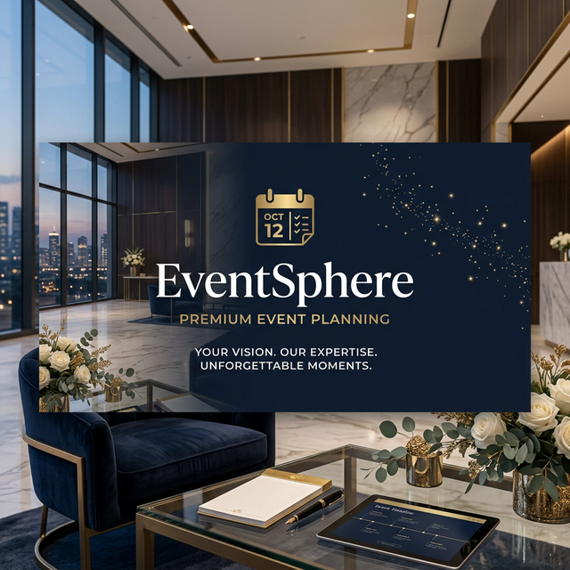

<div align="center">
  

  # ✨ EventSphere ✨
  **Elevating Your Events to Extraordinary Experiences**

  [](https://reactjs.org/)
  [](https://nodejs.org/)
  [](https://www.mongodb.com/)
  [](https://tailwindcss.com/)
  [](https://www.typescriptlang.org/)

  ---
  
  *A sophisticated MERN-stack event planning platform designed to streamline the journey from imagination to celebration.*
</div>

## 📖 Introduction

**EventSphere** is a premium, full-feature event planning and management platform. Whether you are planning a corporate gala, a dream wedding, or a professional seminar, EventSphere provides the tools to manage every detail seamlessly. Our mission is to bridge the gap between event organizers and clients through a visually stunning and highly functional interface.

## 🚀 Key Features

### 💎 For Users
- 📅 **Interactive Event Catalog**: Browse through a curated list of upcoming events with detailed descriptions and pricing.
- 🛍️ **Service Discovery**: Explore specialized services from catering to photography.
- 🎫 **Seamless Booking**: Effortlessly book events and services with real-time status tracking.
- 🖼️ **Visual Gallery**: Gain inspiration from our high-fidelity event photo gallery.
- 🔐 **Secure Authentication**: Integrated Google OAuth and JWT-based secure login.

### 🛠️ For Administrators
- 📊 **Dynamic Dashboard**: A powerful command center to monitor all bookings and user activities.
- ✨ **Event Management**: Create, edit, and delete events with a robust CRUD interface.
- 💼 **Service Control**: Manage service offerings and categories.
- 👥 **User Oversight**: Full visibility into user registrations and booking histories.

## 🛠️ Tech Stack

**Frontend:**
- **Core**: React 19 & Vite
- **Styling**: Tailwind CSS (Glassmorphism & Dark Mode supported)
- **Icons**: Lucide React
- **Routing**: React Router DOM v7
- **Feedback**: Sonner (Toast notifications)

**Backend:**
- **Runtime**: Node.js & Express
- **Database**: MongoDB (via Mongoose ODM)
- **Security**: JWT Authentication & Google OAuth
- **File Handling**: Google Auth Library

## 📦 Getting Started

### Prerequisites
- Node.js (v18+)
- MongoDB Atlas account or local MongoDB instance
- Google Cloud Console Project (for OAuth)

### Installation

1. **Clone the repository**
   ```bash
   git clone https://github.com/your-username/event-planning-website.git
   cd event-planning-website
   ```

2. **Frontend Setup**
   ```bash
   npm install
   ```

3. **Backend Setup**
   ```bash
   cd server
   npm install
   ```

4. **Environment Configuration**
   Create a `.env` file in the `server` directory and add:
   ```env
   MONGODB_URI=your_mongodb_connection_string
   JWT_SECRET=your_jwt_secret
   GOOGLE_CLIENT_ID=your_google_client_id
   PORT=5000
   ```

### Running the App

1. **Start the Backend** (From `/server` directory)
   ```bash
   npm run dev
   ```

2. **Start the Frontend** (From root directory)
   ```bash
   npm run dev
   ```

## 🏗️ Project Structure

```text
├── server/             # Express.js backend
│   ├── models/         # Mongoose schemas
│   ├── routes/         # API endpoints
│   └── index.js        # Server entry point
├── src/                # React frontend
│   ├── components/     # Reusable UI components
│   ├── pages/          # Full-page components
│   ├── hooks/          # Custom React hooks
│   └── lib/            # Utility functions & API config
└── public/             # Static assets
```

---

<div align="center">
  Built with ❤️ by the EventSphere Team
  <br>
  <i>"Your Vision. Our Expertise. Unforgettable Moments."</i>
</div>
